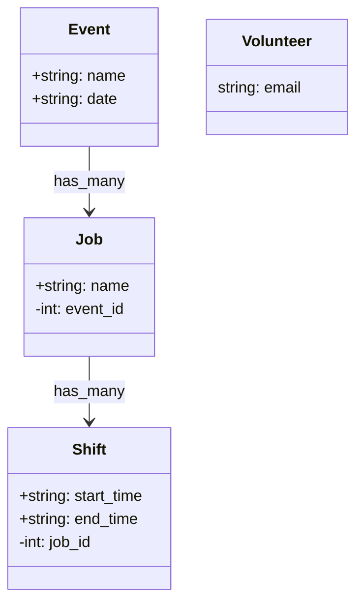

# Moxi Dev Interview

A test application for dev interviews.
<br/>
_(See [INTERVIEW README](./INTERVIEW_README.md))_

**Stack**

- Ruby 3.2.1
- Rails 7.0.4
- sqlite
- RSpec/FactoryBot

**Docker Implementation:** [rails/docked](https://github.com/rails/docked)

## Setup

**Prerequisites:** Just [Docker](https://www.docker.com/)! _(ruby & rails not needed)_

```
git clone git@github.com:moxiworks/moxi-dev-interview.git
cd moxi-dev-interview
d/setup
```

**then**

```
d/rails s
```

## Commands

### `d/rails`

Rails command `d/rails s`, `d/rails db:migrate`, ...

### `d/bundle`

Bundle command `d/bundle install`, `d/bundle config`, ...

### `d/rspec`

Rspec command `d/rspec spec`

### `d/run`

Run any shell command in the container

### `d/shell`

Access the container's bash shell environment


## Class Diagram

